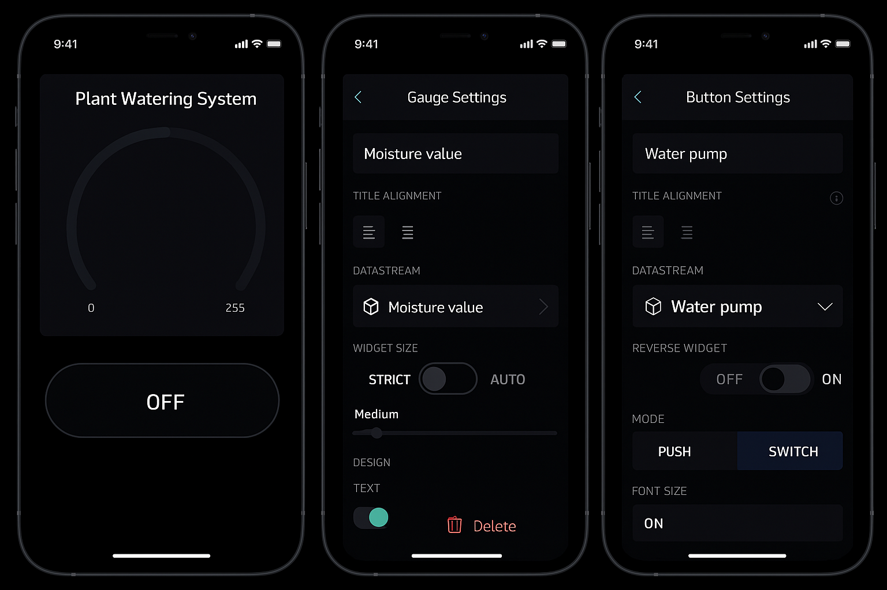

# Smart Plant Watering System 

An IoT-based automated plant watering system built using NodeMCU ESP8266, soil moisture sensor, and the new Blynk platform.

## Features
- Real-time soil moisture monitoring
- Automatic and manual pump control
- Remote monitoring via Blynk (Web + Mobile)
- LCD display for live status

## Tech Stack
- NodeMCU ESP8266
- Blynk IoT (new platform)
- Soil moisture sensor
- Relay module
- Mini water pump
- LCD with I2C module
- Arduino IDE

## Dashboard Setup
Blynk Virtual Pins:
- V0: Soil moisture value (Gauge)
- V1: Water pump control (Button)

## 📷 Screenshots

## 📝 License
This project is open-source and available under the [MIT License](LICENSE).
